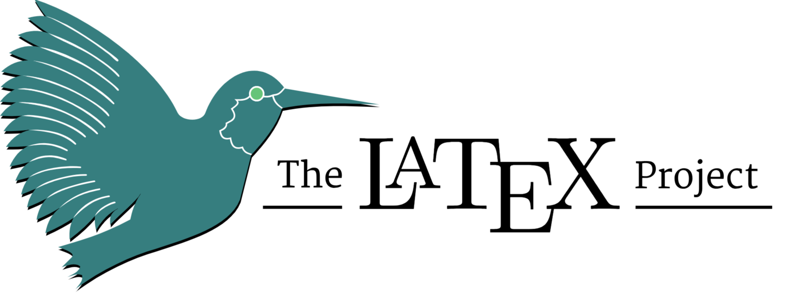

# Latex

::: columns

:::: column

1. Latex is a typesetting system for preparing documents.

2. Unlike other text processors, Latex uses plain text when writing

3. The formatting you can get with Latex is unmatchable $$\vec{w} = \nabla \times \vec{u}$$

4. Latex is over 40 years old!!

::::

:::: column



::::

:::

# Beamer

::: columns

:::: column

1. Beamer is a Latex class to build presentations.

2. This presentation was created by beamer

3. A beamer slide will took like this in code

::::

:::: column

```
\\begin{frame}
\\frametitle{Sample frame title}
This is a text in second frame. 
For the sake of showing an example.

\\begin{itemize}
 \\item<1-> Text visible on slide 1
 \\item<2-> Text visible on slide 2
\\end{itemize}
\\end{frame}
```

::::

:::

# What's the catch

1. Latex takes time to get used to

2. If only there was a way quickly prototype Latex docs


# Pandoc

::: columns

:::: column

1. Pandoc is a Haskell library for converting from one markup format to another

2. You can convert Markdown to Tex/Org/HTML

3. This can be used to create pdfs, books, and slides from existing markdown documents

::::

:::: column

Specify Pandoc to produce Beamer output

```sh
pandoc -t beamer presentations-as-code.md -o presentations-as-code.pdf
```

::::

:::

# Thank you

Any Questions?

