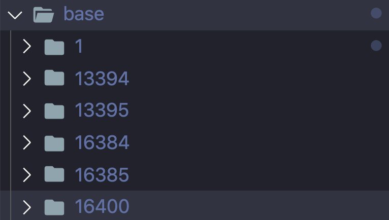

## WIP: Exploring Postgres Internals - Part 1

#### Database

`create database db_1`

Creating a database will create a physical folder in `base`, `base` is the location for all local databases.

```

test=# select oid, datname from pg_database where datname like '%db_1%';
-[ RECORD 1 ]-+-----------
oid           | 16400
datname       | db_1
```

The name of this folder is the `oid` in the `pg_database` meta table. In our case the content is within `16400`



---

#### Relationship

```

db_1=# create table table_a(id int, name text);
db_1=# insert into table_a values(1, 'mark');
db_1=# insert into table_a values(2, 'nimalan');

db_1=# \d table_a
              Table "public.table_a"
 Column |  Type   | Collation | Nullable | Default
--------+---------+-----------+----------+---------
 id     | integer |           |          |
 name   | text    |           |          |
```

```

db_1=# select oid, relname, relfilenode, relpages, reltuples, relhasindex from pg_class where relname like '%table_a%';
-[ RECORD 1 ]-------+--------
oid                 | 16417
relname             | table_a
relfilenode         | 16417
relpages            | 0
reltuples           | 0
relhasindex         | f
```

Hmm, if you note the `relpages` and `reltuples` are 0, even after inserting data. This is because this is stat from the last `VACCUM` or `ANALYSE`. Running it again will be refreshing the page count.

```

db_1=# ANALYSE;
ANALYZE
db_1=# select oid, relname, relfilenode, relpages, reltuples, relhasindex from pg_class where relname like '%table_a%';
-[ RECORD 1 ]--------
oid         | 16417
relname     | table_a
relfilenode | 16417
relpages    | 1
reltuples   | 2
relhasindex | f
```

Let's see the contents of `16417`, 

Some interesting points
- The size of a page is `8kb` in postgres, in the hexdump you would see that it ends at `00002000`

```

❯ hexdump -C 16417
00000000  00 00 00 00 b0 b7 72 01  00 00 00 00 20 00 b0 1f  |......r..... ...|
00000010  00 20 04 20 00 00 00 00  d8 9f 42 00 b0 9f 48 00  |. . ......B...H.|
00000020  00 00 00 00 00 00 00 00  00 00 00 00 00 00 00 00  |................|
*
00001fb0  65 02 00 00 00 00 00 00  00 00 00 00 00 00 00 00  |e...............|
00001fc0  02 00 02 00 02 09 18 00  02 00 00 00 11 6e 69 6d  |.............nim|
00001fd0  61 6c 61 6e 00 00 00 00  64 02 00 00 00 00 00 00  |alan....d.......|
00001fe0  00 00 00 00 00 00 00 00  01 00 02 00 02 09 18 00  |................|
00001ff0  01 00 00 00 0b 6d 61 72  6b 00 00 00 00 00 00 00  |.....mark.......|
00002000
```
