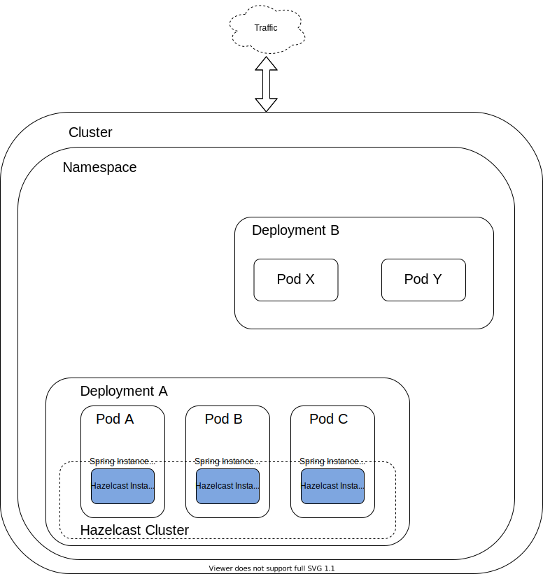

# Spike to test our Spring Embedded Hazelcast instances

You can read a more detailed explaination of the setup [here](https://mark1626.github.io/posts/2021/01/05/distributed-embedded-cache-in-spring-with-hazelcast/)



## Setting the Cluster 

- `export SPRING_SERVER_PORT=<port-number>`
- `./gradlew bootRun`

Set up two or more application instances

## Setting up the instances in k8s with kind

- Build the image `make push-image IMAGE_TAG=1.0.0`
- Create the k8s cluster with kind `make create-kind`
- (Optional) Expose port with ingress controller `make ingress-controller`
- Deploy the services `make deploy-all`

### Clean Up

- `make clean-all`
- `make delete-kind`

## Observations

### Creating new instance

#### Scenario

- Have an existing instance A with some data cached
- Create a new instance B
- Query B to try to fetch data which was cached in A

> **To Note:**
  - Cached data in A is accessible from instance B

Logs from instance A

```
<date> 16:49:01.528  INFO 29229 --- [.IO.thread-in-0] c.h.internal.nio.tcp.TcpIpConnection     : [<ip>]:<portA> [dev] [4.0.1] Initialized new cluster connection between /<ip>:<portA> and /<ip>:51302
<date> 16:49:07.532  INFO 29229 --- [ration.thread-0] c.h.internal.cluster.ClusterService      : [<ip>]:<portA> [dev] [4.0.1]

Members {size:2, ver:4} [
        Member [<ip>]:<portA> - 2f8cbb60-1823-4fba-8d13-2fa9dbf89822 this
        Member [<ip>]:<portB> - 7fb07cd0-5a46-422d-801d-05e6da0b9a63
]

<date> 16:49:07.793  INFO 29229 --- [hertz.migration] c.h.i.partition.impl.MigrationManager    : [<ip>]:<portA> [dev] [4.0.1] Repartitioning cluster data. Migration tasks count: 271
<date> 16:49:09.130  INFO 29229 --- [hertz.migration] c.h.i.partition.impl.MigrationThread     : [<ip>]:<portA> [dev] [4.0.1] All migration tasks have been completed. (repartitionTime=<date> 16:49:07 UTC 2020, plannedMigrations=271, completedMigrations=271, remainingMigrations=0, totalCompletedMigrations=542, elapsedMigrationTime=332ms, totalElapsedMigrationTime=332ms)
```

Logs from instance B

```
<date> 16:49:01.416  INFO 32286 --- [           main] com.hazelcast.core.LifecycleService      : [<ip>]:<portB> [dev] [4.0.1] [<ip>]:<portB> is STARTING
<date> 16:49:01.507  INFO 32286 --- [           main] c.h.i.cluster.impl.MulticastJoiner       : [<ip>]:<portB> [dev] [4.0.1] Trying to join to discovered node: [<ip>]:<portA>
<date> 16:49:01.519  INFO 32286 --- [cached.thread-3] c.h.internal.nio.tcp.TcpIpConnector      : [<ip>]:<portB> [dev] [4.0.1] Connecting to /<ip>:<portA>, timeout: 10000, bind-any: true
<date> 16:49:01.530  INFO 32286 --- [.IO.thread-in-0] c.h.internal.nio.tcp.TcpIpConnection     : [<ip>]:<portB> [dev] [4.0.1] Initialized new cluster connection between /<ip>:51302 and /<ip>:<portA>
<date> 16:49:07.542  INFO 32286 --- [ration.thread-0] c.h.internal.cluster.ClusterService      : [<ip>]:<portB> [dev] [4.0.1]

Members {size:2, ver:4} [
        Member [<ip>]:<portA> - 2f8cbb60-1823-4fba-8d13-2fa9dbf89822
        Member [<ip>]:<portB> - 7fb07cd0-5a46-422d-801d-05e6da0b9a63 this
]

```


### Killing one instance

> **To Note:**
  - Mastership is reclaimed by a surviving instance
  - Most recent partition table is taken and checked if there is a need for repartition

Stack trace from surviving instance

```
<date> 16:51:47.908  INFO 29229 --- [cached.thread-4] c.h.internal.nio.tcp.TcpIpConnector      : [<ip>]:<portA> [dev] [4.0.1] Could not connect to: /<ip>:<portB>. Reason: SocketException[Connection refused to address /<ip>:<portB>]
<date> 16:51:47.908  WARN 29229 --- [cached.thread-4] c.h.i.n.tcp.TcpIpConnectionErrorHandler  : [<ip>]:<portA> [dev] [4.0.1] Removing connection to endpoint [<ip>]:<portB> Cause => java.net.SocketException {Connection refused to address /<ip>:<portB>}, Error-Count: 5
<date> 16:51:47.908  INFO 29229 --- [cached.thread-4] c.h.i.cluster.impl.MembershipManager     : [<ip>]:<portA> [dev] [4.0.1] Removing Member [<ip>]:<portB> - 7fb07cd0-5a46-422d-801d-05e6da0b9a63
<date> 16:51:47.909  INFO 29229 --- [cached.thread-4] c.h.internal.cluster.ClusterService      : [<ip>]:<portA> [dev] [4.0.1]

Members {size:1, ver:5} [
        Member [<ip>]:<portA> - 2f8cbb60-1823-4fba-8d13-2fa9dbf89822 this
]

<date> 16:51:47.909  INFO 29229 --- [cached.thread-1] c.h.t.TransactionManagerService          : [<ip>]:<portA> [dev] [4.0.1] Committing/rolling-back live transactions of [<ip>]:<portB>, UUID: 7fb07cd0-5a46-422d-801d-05e6da0b9a63
<date> 16:51:47.916  INFO 29229 --- [hertz.migration] c.h.i.partition.impl.MigrationManager    : [<ip>]:<portA> [dev] [4.0.1] Partition balance is ok, no need to repartition.
```

### K8s

Service Discovery is needed for the hazelcast member to discover other hazelcast member. One way to achieve this
is to use `hazelcast-kubernetes` which does this autoconfiguration.

> **To Note:** When using `hazelcast-kubernetes` rbac has to be changed so that the pod can view other pods in the service
