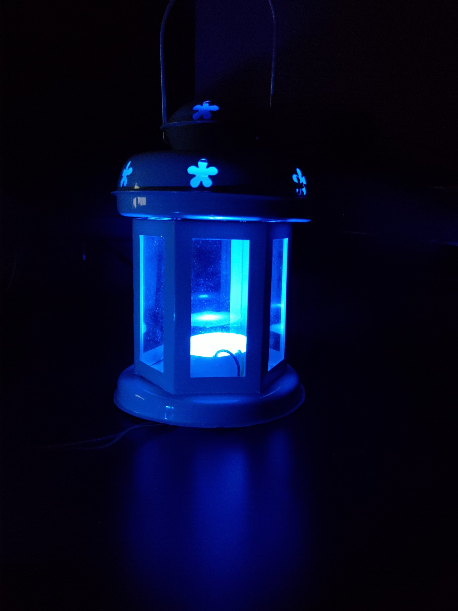

# The Lamp

## Approach 1 - Crazy Spike Ideas

[Approach 1](./approach1/README.md)

Do not run this, it's a combination of several different spikes

- CGI server for Service Discovery
- Cron for orchestration

## Approach 2 - Redis for the rescue

[Approach 1](./approach2/README.md)

- Redis pub/sub for communicating with NodeMCU
