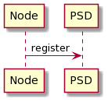
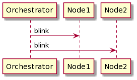

## Approach 1

- NodeMCU registers itself in the Poorman's Service Discovery(PSD).
- Orchestrator contacts all the nodes which are registered

#### Poorman's Service Discovery(PSD)

- CGI server which stores the `ip` and `updatedAt` in an `sqlite` db

## Architecture

#### TODO

This code is unstable and has multiple vulnerabilites
