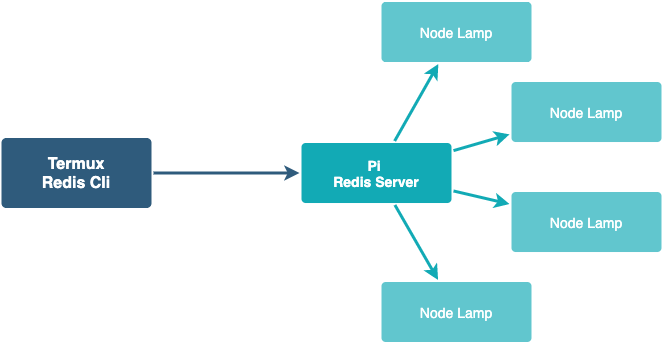

## Approach 2

Server runs Redis. Orchestrator sends message in the redis channel.
Lamp is powered by NodeMCU, which reads messages from the redis channel

## Architecture

#### TODO:
- Find why string comparison fails, as a temporary workaround using `string.format`
